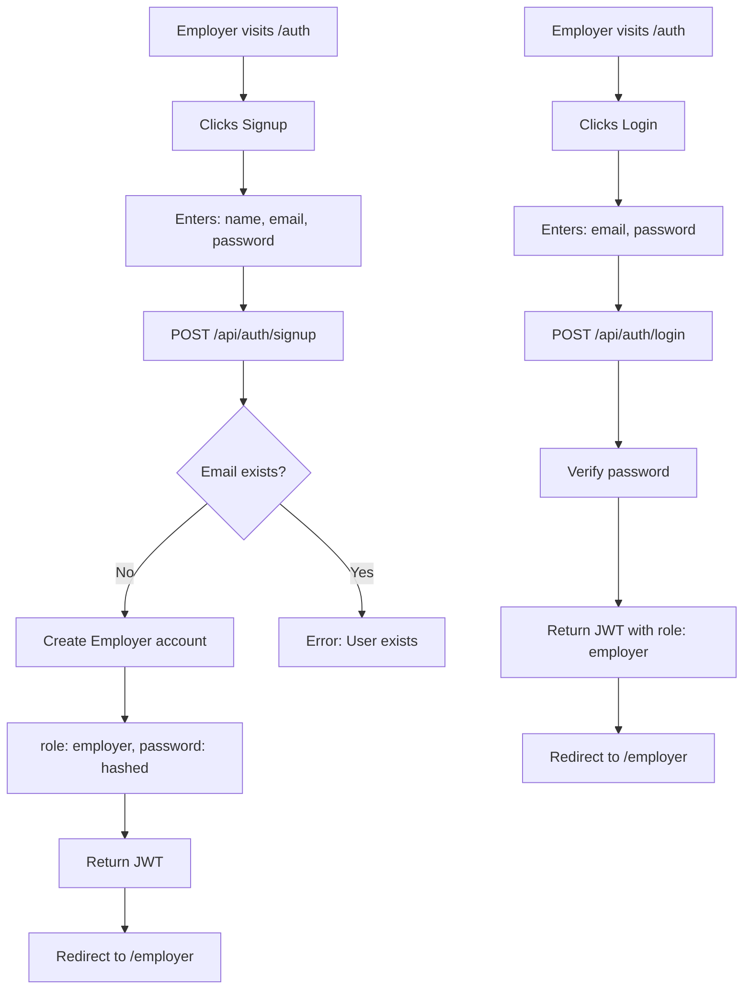
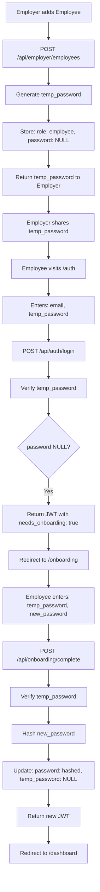
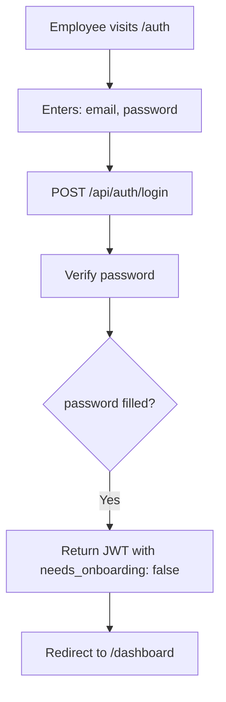

# Role-Based Authentication System - Implementation Plan

**Date**: 2026-02-05  
**Feature**: Multi-role authentication with Employer and Employee user types  
**Status**: ✅ Implemented (Phases 1-5 complete: Backend, Frontend Auth, Employer Dashboard, Employee Onboarding)

---

## Table of Contents
1. [Overview](#overview)
2. [Current vs New Workflow](#current-vs-new-workflow)
3. [User Roles](#user-roles)
4. [Frontend Structure Changes](#frontend-structure-changes)
5. [Backend Structure Changes](#backend-structure-changes)
6. [Database Schema Changes](#database-schema-changes)
7. [API Endpoints](#api-endpoints)
8. [Authentication Flow](#authentication-flow)
9. [Employee Onboarding Process](#employee-onboarding-process)
10. [Security Considerations](#security-considerations)
11. [Edge Cases & Solutions](#edge-cases--solutions)
12. [Implementation Checklist](#implementation-checklist)

---

## Overview

SnappyYak will transition from a single-user authentication system to a role-based system supporting two distinct user types:

- **Employer**: Organization administrators who can add and manage employees
- **Employee**: Team members added by employers with restricted onboarding flow

This change introduces:
- Role-based routing and dashboard access
- Employee onboarding with temporary password system
- Separate UI experiences for employers and employees
- Multi-tenancy foundation for company/team management

---

## Current vs New Workflow

### Current System (Single-User)
```
User → Signup/Login → Same Dashboard UI (/dashboard)
```

### New System (Role-Based)

#### Employer Flow
```
Employer → Signup → Employer Dashboard (/employer)
Employer → Login → Employer Dashboard (/employer)
```

#### Employee Flow
```
Employee → Signup Attempt → Error: "User already exists"
Employee → Login (First Time, password: NULL) → Onboarding (/onboarding) → Employee Dashboard (/dashboard)
Employee → Login (Subsequent, password: filled) → Employee Dashboard (/dashboard)
```

#### Employee Creation Flow
```
Employer → Add Employee (name + email) → Generate temp_password
Backend → Store Employee (temp_password: hashed, password: NULL)
Backend → Return plaintext temp_password to Employer
Employer → Share temp_password with Employee
Employee → Login with temp_password → Onboarding → Create new password
```

---

## User Roles

### Employer
- **Signup**: Allowed (standard registration flow)
- **Dashboard**: `/employer/*` (new UI to build)
- **Capabilities**:
  - Add/remove employees
  - View employee data and productivity metrics
  - Manage company settings
- **Database Fields**:
  - `role: 'employer'`
  - `temp_password: NULL`
  - `password: hashed_password`

### Employee
- **Signup**: Blocked (must be added by Employer)
- **Dashboard**: `/dashboard/*` (current UI, unchanged)
- **Capabilities**:
  - View own productivity data
  - Manage personal settings
  - Submit timesheets/attendance
- **Database Fields**:
  - `role: 'employee'`
  - `temp_password: hashed_temp` (initially)
  - `password: NULL` (until onboarding completed)

---

## Frontend Structure Changes

### New Directory Structure
```
frontend/app/
├── auth/                         # Authentication pages
│   └── page.tsx                  # Login/Signup (UPDATE: add role-based routing)
│
├── dashboard/                    # Employee Dashboard (EXISTING, unchanged)
│   ├── layout.tsx                # Employee sidebar/nav
│   ├── page.tsx                  # Employee home (Employees table)
│   ├── employees/[id]/           # Employee detail views
│   ├── time/                     # Time & Attendance
│   ├── projects/                 # Projects dashboard
│   ├── settings/                 # Personal settings
│   └── download/                 # App downloads
│
├── employer/                     # NEW: Employer Dashboard
│   ├── layout.tsx                # Employer sidebar/nav (borrow from dashboard/layout.tsx)
│   ├── page.tsx                  # Employer home/overview
│   ├── employees/                # NEW: Employee management
│   │   ├── page.tsx              # Employee list + "Add New Employee" button
│   │   ├── add/                  # Add employee form
│   │   │   └── page.tsx          # Form: name, email (returns temp_password)
│   │   └── [id]/                 # Employee detail (employer view)
│   │       └── page.tsx          # View employee data, edit, delete
│   ├── company/                  # NEW: Company settings
│   │   └── page.tsx              # Company profile, billing, etc.
│   └── reports/                  # NEW: Analytics & reporting
│       └── page.tsx              # Team productivity metrics
│
├── onboarding/                   # NEW: Employee Onboarding
│   └── page.tsx                  # Password change form (temp → new password)
│
└── page.tsx                      # Landing page (unchanged)
```

### Routing Logic Updates

**`/auth` Page Updates**:
- On successful login, decode JWT for `role` and `needs_onboarding`
- Redirect based on role:
  - `role: employer` → `/employer`
  - `role: employee` + `needs_onboarding: false` → `/dashboard`
  - `role: employee` + `needs_onboarding: true` → `/onboarding`

**AuthProvider Updates** (`components/providers/AuthProvider.tsx`):
- Decode JWT payload to extract: `{ id, email, role, needs_onboarding }`
- Add context values: `user.role`, `user.needsOnboarding`
- Add route protection logic in `useAuth()` hook

**New Components**:
- `AddEmployeeModal` (`components/employer/AddEmployeeModal.tsx`) - Modal for choosing employee computer type, navigates to add page
- `TempPasswordDisplay` (`components/employer/TempPasswordDisplay.tsx`) - Modal showing generated temp_password with copy-to-clipboard
- `OnboardingForm` (implemented directly in `app/onboarding/page.tsx`) - Temp password, new password, confirm password inputs

**Layout Enhancements**:
- `app/auth/layout.tsx` (NEW) - Shared layout for auth pages with logo and background decoration
- `app/onboarding/layout.tsx` (UPDATED) - Now matches auth layout design for consistency
- `app/employer/employees/add/page.tsx` (NEW) - Form for adding employee (name, email with auto-focus)

---

## Backend Structure Changes

### New Files/Modules

```
backend/src/
├── main.rs                       # (UPDATE: register new routes)
├── auth.rs                       # (UPDATE: add role extraction to AuthUser)
├── routes.rs                     # (UPDATE: existing auth endpoints)
├── employer_routes.rs            # NEW: Employer-specific endpoints
├── onboarding_routes.rs          # NEW: Employee onboarding endpoints
├── models.rs                     # (UPDATE: add role, temp_password fields)
└── schema.rs                     # (AUTO-UPDATED: Diesel schema)
```

### File Details

**`employer_routes.rs`** (NEW):
```rust
// POST /api/employer/employees - Add new employee
// GET /api/employer/employees - List all employees (for current employer)
// GET /api/employer/employees/:id - Get employee details
// DELETE /api/employer/employees/:id - Remove employee
```

**`onboarding_routes.rs`** (NEW):
```rust
// POST /api/onboarding/complete - Complete employee onboarding
```

**`auth.rs`** (UPDATE):
```rust
// Add role field to AuthUser extractor
// Add needs_onboarding calculation to JWT payload
```

**`models.rs`** (UPDATE):
```rust
#[derive(Queryable, Serialize)]
pub struct User {
    pub id: i32,
    pub email: String,
    pub password: Option<String>,      // NOW NULLABLE
    pub temp_password: Option<String>, // NEW FIELD
    pub role: String,                  // NEW FIELD ('employer' | 'employee')
    pub fullname: String,
    pub created_at: chrono::NaiveDateTime,
}

#[derive(Insertable)]
#[diesel(table_name = users)]
pub struct NewUser {
    pub email: String,
    pub password: Option<String>,
    pub temp_password: Option<String>,
    pub role: String,
    pub fullname: String,
}

#[derive(Deserialize)]
pub struct AddEmployeeRequest {
    pub name: String,
    pub email: String,
}

#[derive(Serialize)]
pub struct AddEmployeeResponse {
    pub id: i32,
    pub email: String,
    pub temp_password: String, // Plaintext (only returned once)
}

#[derive(Deserialize)]
pub struct CompleteOnboardingRequest {
    pub temp_password: String,
    pub new_password: String,
}
```

---

## Database Schema Changes

### Migration: Add Role and Temp Password Fields

**File**: `backend/migrations/YYYY-MM-DD-HHMMSS_add_role_and_temp_password/up.sql`

```sql
-- Add role column (default to 'employee' for existing users)
ALTER TABLE users ADD COLUMN role TEXT NOT NULL DEFAULT 'employee';

-- Add temp_password column (nullable)
ALTER TABLE users ADD COLUMN temp_password TEXT;

-- Make password column nullable (for employees before onboarding)
-- SQLite doesn't support ALTER COLUMN, so we need to recreate the table

-- Create new table with updated schema
CREATE TABLE users_new (
    id INTEGER PRIMARY KEY AUTOINCREMENT,
    email TEXT UNIQUE NOT NULL,
    password TEXT,                    -- Now nullable
    temp_password TEXT,               -- New field
    role TEXT NOT NULL DEFAULT 'employee',  -- New field
    fullname TEXT NOT NULL,
    created_at TIMESTAMP DEFAULT CURRENT_TIMESTAMP
);

-- Copy existing data (set role to 'employer' for existing users)
INSERT INTO users_new (id, email, password, temp_password, role, fullname, created_at)
SELECT id, email, password, NULL, 'employer', fullname, created_at
FROM users;

-- Drop old table and rename new one
DROP TABLE users;
ALTER TABLE users_new RENAME TO users;

-- Recreate indexes
CREATE UNIQUE INDEX idx_users_email ON users(email);
```

**File**: `backend/migrations/YYYY-MM-DD-HHMMSS_add_role_and_temp_password/down.sql`

```sql
-- Reverse migration (remove role and temp_password columns)
CREATE TABLE users_old (
    id INTEGER PRIMARY KEY AUTOINCREMENT,
    email TEXT UNIQUE NOT NULL,
    password TEXT NOT NULL,
    fullname TEXT NOT NULL,
    created_at TIMESTAMP DEFAULT CURRENT_TIMESTAMP
);

INSERT INTO users_old (id, email, password, fullname, created_at)
SELECT id, email, COALESCE(password, temp_password, 'MIGRATION_ERROR'), fullname, created_at
FROM users;

DROP TABLE users;
ALTER TABLE users_old RENAME TO users;

CREATE UNIQUE INDEX idx_users_email ON users(email);
```

### Updated Schema Definition

**Diesel Schema** (`backend/src/schema.rs`):
```rust
diesel::table! {
    users (id) {
        id -> Integer,
        email -> Text,
        password -> Nullable<Text>,      // UPDATED
        temp_password -> Nullable<Text>, // NEW
        role -> Text,                    // NEW
        fullname -> Text,
        created_at -> Timestamp,
    }
}
```

---

## API Endpoints

### Existing Endpoints (Updates Required)

#### POST /api/auth/signup
**Current Behavior**: Create user, return JWT  
**New Behavior**:
- Check if email exists → Return "User already exists" (prevents Employee self-signup)
- If new email → Create Employer account
  - `role: 'employer'`
  - `temp_password: NULL`
  - `password: hashed_password`

**Request**:
```json
{
  "fullname": "John Employer",
  "email": "employer@company.com",
  "password": "securePassword123"
}
```

**Response**:
```json
{
  "token": "eyJhbGciOiJIUzI1NiIsInR5cCI6IkpXVCJ9...",
  "user": {
    "id": 1,
    "email": "employer@company.com",
    "fullname": "John Employer",
    "role": "employer",
    "needs_onboarding": false
  }
}
```

---

#### POST /api/auth/login
**New Logic**:
- Find user by email
- If `password` is filled → Verify against `password`
- If `password` is NULL → Verify against `temp_password`
- Generate JWT with payload: `{ id, email, role, needs_onboarding }`
  - `needs_onboarding = (role == 'employee' && password == NULL)`

**Request**:
```json
{
  "email": "employee@company.com",
  "password": "temp_abc123xyz"
}
```

**Response (First-time Employee)**:
```json
{
  "token": "eyJhbGciOiJIUzI1NiIsInR5cCI6IkpXVCJ9...",
  "user": {
    "id": 2,
    "email": "employee@company.com",
    "fullname": "Jane Employee",
    "role": "employee",
    "needs_onboarding": true
  }
}
```

**Response (Returning Employee)**:
```json
{
  "token": "eyJhbGciOiJIUzI1NiIsInR5cCI6IkpXVCJ9...",
  "user": {
    "id": 2,
    "email": "employee@company.com",
    "fullname": "Jane Employee",
    "role": "employee",
    "needs_onboarding": false
  }
}
```

---

#### GET /api/auth/me
**New Response** (add `role` and `needs_onboarding`):
```json
{
  "user": {
    "id": 2,
    "email": "employee@company.com",
    "fullname": "Jane Employee",
    "role": "employee",
    "needs_onboarding": false
  }
}
```

---

### New Endpoints

#### POST /api/employer/employees
**Purpose**: Add new employee (Employer-only)  
**Auth**: Requires JWT with `role: employer`

**Request**:
```json
{
  "name": "Jane Employee",
  "email": "jane@company.com"
}
```

**Process**:
1. Validate JWT role is `employer`
2. Check if email already exists → Return error if exists
3. Generate random temp password (12 chars: alphanumeric)
4. Hash temp password with Argon2id
5. Insert employee record:
   - `role: 'employee'`
   - `temp_password: hashed_temp`
   - `password: NULL`
   - `fullname: name`
6. Return plaintext temp_password (ONLY returned once)

**Response**:
```json
{
  "id": 2,
  "email": "jane@company.com",
  "fullname": "Jane Employee",
  "temp_password": "Xy9K2mP4nQ7s",
  "message": "Employee added successfully. Share this temporary password securely."
}
```

**Error Responses**:
```json
// Unauthorized (non-employer)
{ "error": "Unauthorized. Only employers can add employees." }

// Email exists
{ "error": "Email already exists" }
```

---

#### GET /api/employer/employees
**Purpose**: List all employees for the current employer  
**Auth**: Requires JWT with `role: employer`

**Response**:
```json
{
  "employees": [
    {
      "id": 2,
      "email": "jane@company.com",
      "fullname": "Jane Employee",
      "onboarded": true,
      "created_at": "2026-02-05T12:00:00Z"
    },
    {
      "id": 3,
      "email": "john@company.com",
      "fullname": "John Employee",
      "onboarded": false,
      "created_at": "2026-02-06T09:30:00Z"
    }
  ]
}
```

---

#### POST /api/onboarding/complete
**Purpose**: Complete employee onboarding (set new password)  
**Auth**: Requires JWT with `role: employee` and `needs_onboarding: true`

**Request**:
```json
{
  "temp_password": "Xy9K2mP4nQ7s",
  "new_password": "MyNewSecurePass123"
}
```

**Process**:
1. Validate JWT (employee role)
2. Retrieve user from database
3. Verify `temp_password` matches hashed `temp_password` in DB
4. Validate `new_password` strength (min 8 chars)
5. Hash `new_password` with Argon2id
6. Update user: `password: hashed_new_password`, `temp_password: NULL`

**Response**:
```json
{
  "message": "Onboarding complete. You can now log in with your new password.",
  "token": "eyJhbGciOiJIUzI1NiIsInR5cCI6IkpXVCJ9..." // New token with needs_onboarding: false
}
```

**Error Responses**:
```json
// Invalid temp password
{ "error": "Invalid temporary password" }

// Weak password
{ "error": "Password must be at least 8 characters" }
```

---

## Authentication Flow

### Employer Signup/Login Flow



### Employee First-Time Login Flow



### Employee Subsequent Login Flow



---

## Employee Onboarding Process

### Step-by-Step

1. **Employer Adds Employee**:
   - Navigate to `/employer/employees`
   - Click "Add New Employee"
   - Enter name and email
   - Submit form → POST `/api/employer/employees`

2. **Backend Generates Credentials**:
   - Generate 12-character random temp password (e.g., `Xy9K2mP4nQ7s`)
   - Hash temp password with Argon2id
   - Create employee record:
     ```
     role: 'employee'
     temp_password: '$argon2id$v=19$m=4096,t=3,p=1$...'
     password: NULL
     ```

3. **Employer Receives Temp Password**:
   - Display modal/page showing:
     - Employee email
     - Temp password (with copy-to-clipboard button)
     - Warning: "This password will only be shown once"
   - Employer shares temp password with employee (email, Slack, etc.)

4. **Employee First Login**:
   - Employee visits `/auth`
   - Enters email and temp_password
   - Backend verifies temp_password against hashed value
   - Returns JWT with `needs_onboarding: true`

5. **Onboarding Redirect**:
   - AuthProvider detects `needs_onboarding: true`
   - Redirects to `/onboarding`

6. **Password Change Form**:
   - Employee sees form:
     - Current Temp Password (input)
     - New Password (input, type=password)
     - Confirm New Password (input, type=password)
   - Submits → POST `/api/onboarding/complete`

7. **Onboarding Complete**:
   - Backend verifies temp_password again
   - Hashes new password
   - Updates database: `password: hashed_new`, `temp_password: NULL`
   - Returns new JWT with `needs_onboarding: false`
   - Redirects to `/dashboard`

8. **Subsequent Logins**:
   - Employee uses new password
   - Logs in directly to `/dashboard`

---

## Security Considerations

### Implemented Security Measures

1. **Temp Password Hashing**:
   - Temp passwords are hashed with Argon2id before storage
   - Never stored in plaintext in database

2. **Role-Based Access Control**:
   - JWT includes `role` claim
   - Backend validates role on protected endpoints
   - Employer endpoints reject non-employer JWTs

3. **One-Time Temp Password Display**:
   - Plaintext temp password only returned once on creation
   - Employer must copy/save it immediately

4. **Password Strength Validation**:
   - Minimum 8 characters for new passwords
   - (Future) Add complexity requirements (uppercase, numbers, symbols)

5. **Input Sanitization**:
   - All inputs trimmed (`.trim()`)
   - Email format validation

### Potential Vulnerabilities & Mitigations

#### 1. Temp Password Interception
**Risk**: Employer shares temp password via insecure channel (email, chat)  
**Mitigation**:
- Add temp password expiration (e.g., 7 days)
- Implement secure invite link system (future enhancement)

#### 2. Brute Force Temp Password Guessing
**Risk**: Attacker tries to guess temp passwords  
**Mitigation**:
- Use cryptographically secure random generation (12+ chars)
- Implement rate limiting on login endpoint
- Lock account after N failed attempts

#### 3. Employee Account Takeover
**Risk**: Malicious employer creates employee account with their own email  
**Mitigation**:
- Email verification before account activation (future)
- Employee must confirm email before onboarding

#### 4. Lost Temp Password
**Risk**: Employee loses temp password before first login  
**Mitigation**:
- Employer can re-generate temp password (add endpoint)
- Password reset flow for employees

---

## Edge Cases & Solutions

### 1. Employee Loses Temp Password Before First Login
**Problem**: Employee never completes onboarding, loses temp password  
**Solution**:
- Add endpoint: `POST /api/employer/employees/:id/reset-temp-password`
- Employer can regenerate temp password
- Old temp password is invalidated

### 2. Duplicate Employee Email
**Problem**: Employer tries to add employee with existing email  
**Solution**:
- Check email uniqueness before insertion
- Return clear error: "Email already exists in system"

### 3. Employer Accidentally Deletes Employee Mid-Onboarding
**Problem**: Employee is deleted before completing onboarding  
**Solution**:
- Implement soft delete (`is_active: false`)
- Or prevent deletion of employees who haven't onboarded

### 4. Employee Completes Onboarding Twice
**Problem**: Employee submits onboarding form multiple times  
**Solution**:
- Check if `password` is already set
- Return error: "Onboarding already completed"

### 5. Existing Users Migration
**Problem**: Current database has users without roles  
**Solution**:
- Migration sets all existing users to `role: 'employer'`
- Manual review/update if needed

### 6. Multi-Company Employees
**Problem**: Employee works for multiple companies  
**Solution** (Future):
- Add `company_id` foreign key
- Allow same email with different company_id
- Unique constraint: `(email, company_id)`

### 7. Temp Password Expiration
**Problem**: Temp password never expires, security risk  
**Solution**:
- Add `temp_password_expires_at` timestamp
- Check expiration on login
- Force re-generation if expired

---

## Implementation Checklist

### Phase 1: Database & Backend Foundation
- [x] Create migration: Add `role`, `temp_password` columns, make `password` nullable
- [x] Run migration: `diesel migration run`
- [x] Update `models.rs`: Add new fields to User, NewUser structs
- [x] Update `schema.rs`: Verify Diesel auto-generated schema
- [x] Add temp password generation utility function (12-char alphanumeric)

### Phase 2: Backend API Updates
- [x] Update `auth.rs`: Add `role` and `needs_onboarding` to JWT payload
- [x] Update `POST /api/auth/signup`: Set `role: 'employer'` for new signups
- [x] Update `POST /api/auth/login`: Check password vs temp_password, calculate `needs_onboarding`
- [x] Update `GET /api/auth/me`: Include `role` and `needs_onboarding` in response
- [x] Create `employer_routes.rs`:
  - [x] `POST /api/employer/employees` (add employee)
  - [x] `GET /api/employer/employees` (list employees)
  - [x] `GET /api/employer/employees/:id` (get employee)
  - [x] `DELETE /api/employer/employees/:id` (remove employee)
- [x] Create `onboarding_routes.rs`:
  - [x] `POST /api/onboarding/complete` (complete onboarding)
- [x] Add role-based middleware/guards for protected endpoints
- [x] Test all endpoints with curl/Postman

### Phase 3: Frontend - AuthProvider & Routing
- [x] Update `AuthProvider.tsx`: Decode `role` and `needs_onboarding` from JWT
- [x] Add context values: `user.role`, `user.needsOnboarding`
- [x] Update `auth/page.tsx`: Implement role-based redirect after login
    - [x] `role: employer` → `/employer`
    - [x] `role: employee` + `needs_onboarding: true` → `/onboarding`
    - [x] `role: employee` + `needs_onboarding: false` → `/dashboard`
- [x] Add route protection in `useAuth()` hook
    - [x] Created `useRequireAuth` hook for granular protection.
    - [x] Protected `/employer` routes.
    - [x] Protected `/onboarding` routes.
    - [x] Updated `/dashboard` protection.

### Phase 4: Frontend - Employer Dashboard
- [x] Create `/employer` directory structure
- [x] Create `employer/layout.tsx`: Employer sidebar with custom navigation
- [x] Create `employer/page.tsx`: Productivity Trends overview with period controls
- [ ] Create `employer/employees/page.tsx`: Employee list with "Add New Employee" button
- [x] Create `employer/employees/add/page.tsx`: Add employee form (name, email)
- [x] Create `TempPasswordDisplay` component: Show generated temp password with copy-to-clipboard
- [x] Integrate API calls: Add employee, list employees


### Phase 5: Frontend - Employee Onboarding
- [x] Create `onboarding/page.tsx`: Password change form
- [x] Create `OnboardingForm` component:
  - [x] Current Temp Password input
  - [x] New Password input (with visibility toggle)
  - [x] Confirm Password input
  - [x] Validation: Passwords match, min 8 chars
- [x] Integrate API: `POST /api/onboarding/complete`
- [x] Handle success: Update JWT, redirect to `/dashboard`
- [x] Update `onboarding/layout.tsx`: Match auth page design (logo, background)


### Phase 6: Testing & Verification
- [ ] Test Employer signup flow (browser)
- [ ] Test Employer adds Employee (verify temp password generation)
- [ ] Test Employee first login with temp password (verify onboarding redirect)
- [ ] Test Employee onboarding completion (password change)
- [ ] Test Employee subsequent login (verify direct dashboard access)
- [ ] Test role-based route protection (employer can't access `/dashboard`, etc.)
- [ ] Test edge cases (duplicate email, invalid temp password, etc.)

### Phase 7: Documentation
- [ ] Update `.agents/architecture.md`: Add new routing structure
- [ ] Update `.agents/current_status.md`: Move from "Pending" to "Implemented"
- [ ] Update `AGENTS.md`: Add role-based auth rules
- [ ] Update `.agents/SOP/backend_authentication_guide.md`: Document new endpoints
- [ ] Update `README.md`: Add role-based setup instructions

---

## Future Enhancements

### Multi-Tenancy & Company Management
- Add `companies` table with `company_id` foreign key
- Allow employees to belong to multiple companies
- Implement company-switching UI

### Email Verification
- Send verification email to new employees
- Require email confirmation before onboarding
- Implement email templates

### Temp Password Expiration
- Add `temp_password_expires_at` timestamp
- Auto-expire after 7 days
- Notify employer of expired temp passwords

### Password Reset for Employees
- Implement "Forgot Password" flow for employees
- Send reset link via email
- Allow password reset without temp password

### Advanced Role Management
- Add more granular roles (Admin, Manager, Member, etc.)
- Implement permission-based access control
- Role-based feature flags

### Audit Logging
- Log employee additions/deletions
- Track onboarding completions
- Monitor failed login attempts

### UI/UX Improvements
- Dark mode support for employer dashboard
- Employee onboarding welcome message/tutorial
- Dashboard analytics for employer (team productivity)


---

## Testing Credentials

**CRITICAL**: For all testing and verification, use these exact credentials. DO NOT create your own.

### Employer Account
- **Name**: `Allwell Employer`
- **Email**: `employer@company.com`
- **Password**: `password123`

### Employee Accounts

**Employee 1:**
- **Name**: `John Doe`
- **Email**: `john.doe@company.com`
- **Password**: `password123`

**Employee 2:**
- **Name**: `Barry Scot`
- **Email**: `barry.scot@company.com`
- **Password**: `password123`

---

## Notes

- This document reflects the planned implementation as of 2026-02-05
- All code examples are illustrative and may require adjustments during implementation
- Security considerations should be reviewed before production deployment
- Refer to `AGENTS.md` for coding standards and conventions
